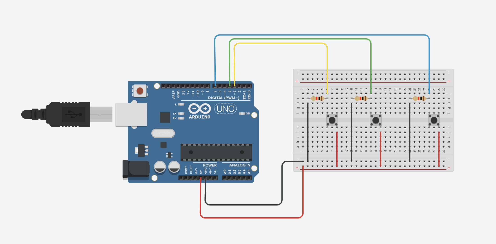

# Emulador de Teclado com Arduino e Python

Este projeto usa um Arduino para emular um teclado com três botões e um script Python para ler e interpretar a saída da porta serial. Siga as instruções abaixo para configurar o hardware e o software.

## Componentes Necessários

- **Arduino Uno** (ou uma placa Arduino compatível)
- **3 Botões** (push buttons)
- **Resistores de Pull-down**
- **Fios de Conexão**
- **Protoboard** (opcional, para montagem dos componentes)
- **Computador** com **Python** instalado

## Esquema de Conexão

1. **Conecte os Botões ao Arduino**:
   - **Botão 1**: Conecte um terminal ao pino digital 7 e o outro ao GND.
   - **Botão 2**: Conecte um terminal ao pino digital 3 e o outro ao GND.
   - **Botão 3**: Conecte um terminal ao pino digital 4 e o outro ao GND.



## Instruções para Configuração e Upload do Código no Arduino

1. **Instale o Arduino IDE**:
   - **Baixe o Arduino IDE**: Acesse [a página de downloads do Arduino](https://www.arduino.cc/en/software) e baixe a versão apropriada para seu sistema operacional.
   - **Instale o Arduino IDE**: Siga as instruções fornecidas pelo instalador.

2. **Conecte o Arduino ao Computador**:
   - Use um cabo USB para conectar a placa Arduino ao seu computador.

3. **Abra o Arduino IDE**:
   - Inicie o Arduino IDE.

4. **Configure a Placa e a Porta**:
   - No menu **"Tools"** (Ferramentas), selecione **"Board"** (Placa) e escolha **"Arduino Uno"** (ou a placa que você está usando).
   - Em **"Port"** (Porta), selecione a porta à qual o Arduino está conectado (geralmente é algo como **"COM3"** no Windows ou **"/dev/ttyUSB0"** no Linux).

5. **Carregue o Código no Arduino**:
   - Copie o código acima e cole-o na área de edição do Arduino IDE.
   - Clique no botão **"Upload"** (Seta para a direita) na barra de ferramentas do IDE.
   - Aguarde até que a mensagem **"Done uploading"** (Carregamento concluído) apareça na parte inferior da janela.

6. **Verifique a Comunicação Serial**:
   - Após o upload, abra o Monitor Serial clicando no ícone de lupa na parte superior direita ou vá para **"Tools"** > **"Serial Monitor"**.
   - Certifique-se de que a taxa de transmissão (baud rate) está configurada para **9600**.

## Código Python para Leitura da Porta Serial

Instale a biblioteca `pyserial` se ainda não a tiver:

```bash
pip install pyserial
```
Instale a biblioteca `pynput` se ainda não a tiver:

```bash
pip install pynput
```

O script Python a seguir lê os dados da porta COM3 e simula a pressão das teclas com base na entrada recebida:
ine}")


## Observações

- **Porta Serial**: Certifique-se de que a porta serial configurada no Python (`COM3` no exemplo) corresponde à porta à qual o Arduino está conectado.
- **Dependências**: O script Python utiliza as bibliotecas `pyserial` e `pynput`. Instale-as usando `pip` se ainda não o fez.

## Contribuições

Se você encontrar problemas ou tiver sugestões de melhorias, sinta-se à vontade para abrir uma *issue* ou enviar um *pull request*.
